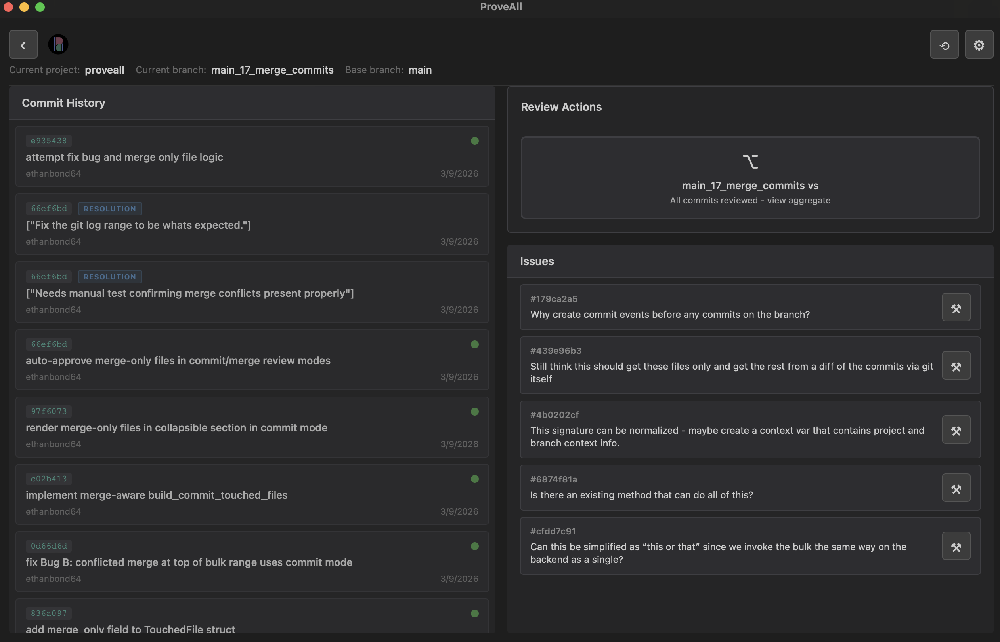
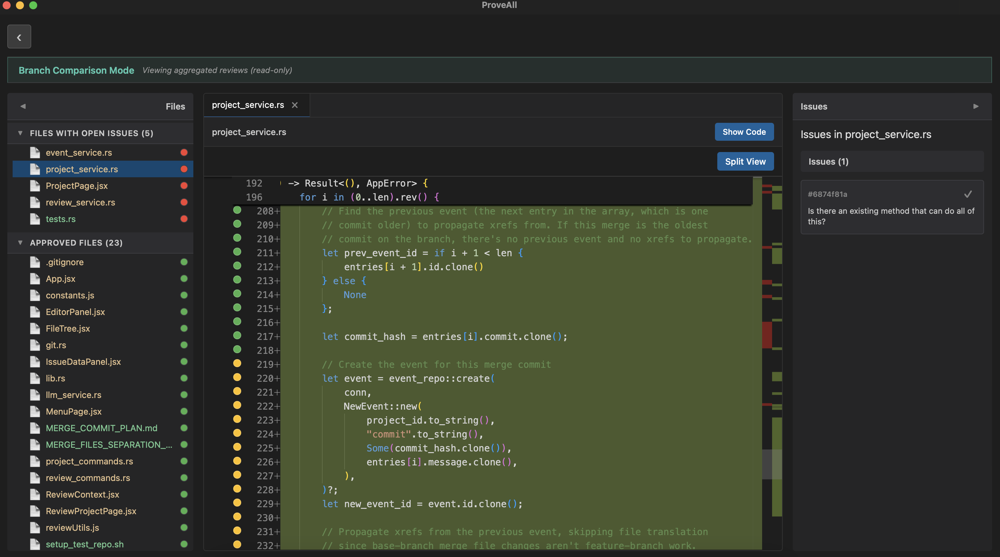

# ProveAll

**Code Coverage for Human Understanding**

**Currently available on:** macOS (Apple Silicon)

ProveAll is a desktop app that helps developers maintain understanding and control of AI-generated code. It's built on top of Git, storing a review state for every line of code at each commit. ProveAll gives you a structured way to prove you understand every line before it ships.

## Installation

Download the latest `.dmg` from the [GitHub Releases page](https://github.com/ethanbond64/proveall/releases), open it, and drag ProveAll to your Applications folder.

## Example usage

### Project Page
View commit history, review history, and open issues in your branch at a glance.

### Branch Comparison View
See the full diff of your branch against its base, with line-level approval status and inline issues.

## Suggested Workflow

1. **Commit your work.** Commit any work done by an AI coding agent immediately. This gives you a reviewable unit of work.
2. **Review the commit in ProveAll.** Open the commit in ProveAll's editor. Go through the diff file by file, or line by line. Approve what you understand, raise issues on anything that looks wrong or unclear.
   - **File-level reviews:** Click the first circle next to the filename to review every line in the file at once.
   - **Line-level reviews:** Highlight specific lines in the editor, then click the blue circles in the gutter to review just those lines.
   - **Chunk-level reviews:** Click a diff chunk to select all lines in it and review them in a single action.
3. **Iterate in parallel.** While reviewing one commit, kick off your next AI prompt in the background. Commit or discard the result based on how the previous review went.
4. **Check the branch view.** Once all commits are reviewed, open the branch comparison to see the composite state: which files are fully approved, which still have open issues, and which lines need to be addressed before merging.

